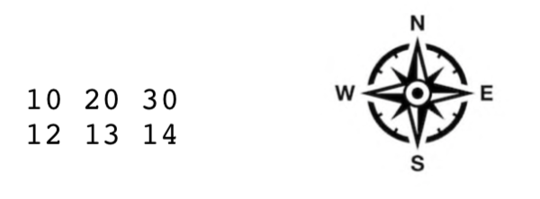

# CSCI561_AI_SearchAlgorithms
  ## Project Description
  In this project, we twist the problem of path planning a little bit just to give you the opportunity to deepen your       understanding of search algorithms by modifying search techniques to fit the criteria of a realistic problem.The goal of this mission is to send a sophisticated mobile lab to Mars to study the surface of the planet more closely. We are invited to develop an algorithm to find the optimal path for navigation of the rover based on a particular objective.

The input of our program includes a topographical map of the mission site, plus some information about intended landing site and target locations and some other quantities that control the quality of the solution. The surface of the planet can be imagined as a surface in a 3- dimensional space. A popular way to represent a surface in 3D space is using a mesh-grid with a Z value assigned to each cell that identifies the elevation of the planet at the location of the cell. At each cell, the rover can move to each of 8 possible neighbor cells: North, North-East, East, South-East, South, South-West, West, and North-West. Actions are assumed to be deterministic and error-free (the rover will always end up at the intended neighbor cell).

The rover is not designed to climb across steep hills and thus moving to a neighboring cell which requires the rover to climb up or down a surface which is steeper than a particular threshold value is not allowed. This maximum slope **(expressed as a difference in Z elevation between adjacent cells)** will be given as an input along with the topographical map.
  
  ## Search for the optimal paths
  Our task is to move the rover from its landing site to one of the target sites for experiments and soil sampling. For an ideal rover that can cross every place, usually the shortest geometrical path is defined as the optimal path; however, since in this project we have some operational concerns, our objective is first to avoid steep areas and thus we want to minimize the path from A to B under those constraints. Thus, our goal is, roughly, finding the shortest path among the safe paths. What defines the safety of a path is the maximum slope between any two adjacent cells along that path.
  
  ## Problem Definition
  The program takes an input file as input that describes the terrain map, landing site, target sites, and characteristics of the robot. For each target site, the optimal (shortest) safe path **from the landing site to that target** is found. A path is composed of a sequence of elementary moves. Each elementary move consists of moving the rover to one of its 8 neighbors. 
To find the solution you will use the following algorithms:
  - Breadth-first search (BFS)
  - Uniform-cost search (UCS)
  - A* search (A*).
 
The algorithm returns an **optimal path**, that is, with shortest possible operational path length. If an optimal path cannot be found, the algorithm returns “FAIL”.

  ## Terrain Map
  A matrix with H rows (where H is a strictly positive integer) and W columns (W is also a strictly positive integer) will be given, with a Z elevation value (an integer number, to avoid rounding problems) specified in every cell of the WxH map. For example:
  

is a map with W=3 columns and H=2 rows, and each cell contains a Z value (in arbitrary units). By convention, we will use North (N), East (E), South (S), West (W) as shown above to describe motions from one cell to another. In the above example, Z elevation in the North West corner of the map is 10, and Z elevation in the South East corner is 14.

## Input
The file input.txt in the current directory of your program will be formatted as follows:
- **First line:** Instruction of which algorithm to use, as a string: BFS, UCS or A*
- **Second line:** Two strictly positive 32-bit integers separated by one space character, for “W H” the number of columns (width) and rows (height), in cells, of the map.
- **Third line:** Two positive 32-bit integers separated by one space character, for “X Y” the coordinates (in cells) of the landing site. 0 <= X <= W-1 and 0 <= Y <= H-1 (that is, we use 0-based indexing into the map; X increases when moving East and Y increases when moving South; (0,0) is the North West corner of the map).
- **Fourth line:** Positive 32-bit integer number for the maximum difference in elevation between two adjacent cells which the rover can drive over. The difference in Z between two adjacent cells must be **smaller than or equal (<=)** to this value for the rover to be able to travel from one cell to the other.
- **Fifth line:** Strictly positive 32-bit integer **N, the number of target sites.**
- **Next N lines:** Two positive 32-bit integers separated by one space character, for “X Y” the coordinates (in cells) of each target site. 0 <= X <= W-1 and 0 <= Y <= H-1 (that is, we again use 0-based indexing into the map).
- **Next H lines:** W 32-bit integer numbers separated by any numbers of spaces for the elevation (Z) values of each of the W cells in each row of the map.

## Output
The file output.txt which your program creates in the current directory should be formatted as follows:
- **N lines:** Report the paths in the same order as the targets were given in the input.txt file. Write out one line per target. Each line should contain a sequence of X,Y pairs of coordinates of cells visited by the rover to travel from the landing site to the corresponding target site for that line. Only use a single comma and no space to separate X,Y and a single space to separate successive X,Y entries. If no solution was found (target site unreachable by rover from given landing site), write a single word **FAIL** in the corresponding line.

**Sample testcases can be found in this respository (sampletestcase.txt, sampletestcase2.txt)**
